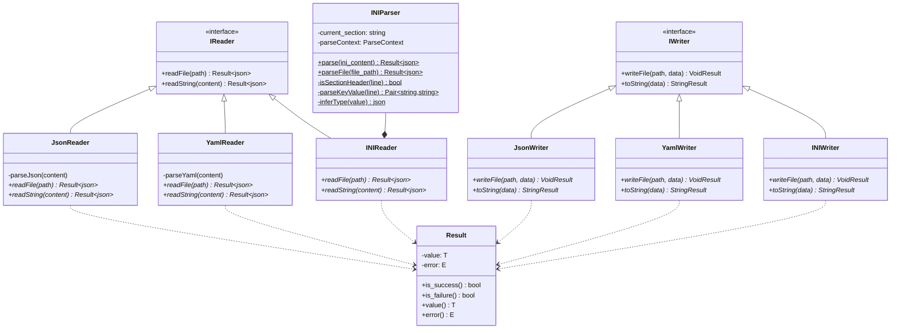

# ConfigGUI Software Design Document

**Version**: 2.0  
**Date**: October 28, 2025  
**Status**: ✅ Production Ready  
**Last Updated**: Phase 2D Complete (INI Support, Multi-Format Save)

---

## Table of Contents

1. [Executive Summary](#executive-summary)
2. [System Architecture](#system-architecture)
3. [Class Diagrams](#class-diagrams)
4. [Component Architecture](#component-architecture)
5. [Design Patterns](#design-patterns)
6. [Data Flow](#data-flow)
7. [Module Dependencies](#module-dependencies)
8. [Technology Stack](#technology-stack)

---

## Executive Summary

ConfigGUI is a dual-target configuration management system that provides both desktop (Qt GUI) and web (HTTP Server) interfaces for schema-driven form generation and configuration file management.

**Key Architectural Principles:**
- **Qt-Free Core**: Core library has zero Qt dependencies, enabling code reuse
- **Modular Design**: Separate concerns across core, I/O, UI, and validators
- **Consistent Patterns**: Result<T> for error handling, static reader/writer classes
- **Multi-Format Support**: JSON, YAML, INI file handling
- **Hybrid Storage**: Local PC + Server backup for configurations

---

## System Architecture

### Three-Layer Architecture Diagram


### Dual-Target Build Configuration


---

## Class Diagrams

### Core I/O Class Hierarchy



### Schema and Validation Architecture


### Qt GUI Architecture


### HTML/JavaScript Architecture


---

## Component Architecture

### Module Organization


### File Format Support Pipeline


---

## Design Patterns

### 1. Result<T, E> Pattern - Error Handling

**Pattern Type**: Functional Error Handling  
**Purpose**: Replace exceptions with Result objects carrying success/failure information

```cpp
// Definition
template<typename T, typename E = std::string>
class Result {
    std::optional<T> value_;
    std::optional<E> error_;
public:
    bool is_success() const { return value_.has_value(); }
    bool is_failure() const { return error_.has_value(); }
    T value() const { return value_.value(); }
    E error() const { return error_.value(); }
};

// Usage
Result<json> result = INIReader::readFile("config.ini");
if (result.is_success()) {
    json config = result.value();
    // Process config
} else {
    std::cerr << "Error: " << result.error() << std::endl;
}
```

**Benefits:**
- ✅ No exception overhead
- ✅ Explicit error handling
- ✅ Composable error chains
- ✅ MISRA C++ compliant

### 2. Static Reader/Writer Pattern

**Pattern Type**: Factory Method + Facade  
**Purpose**: Provide consistent interface across different file formats

```cpp
// Interface
class IReader {
public:
    virtual Result<json> readFile(const std::string& path) = 0;
    virtual Result<json> readString(const std::string& content) = 0;
};

// Concrete implementations
class JsonReader : public IReader { /* ... */ };
class YamlReader : public IReader { /* ... */ };
class INIReader : public IReader { /* ... */ };

// Usage
Result<json> json_data = JsonReader::readFile("config.json");
Result<json> yaml_data = YamlReader::readFile("config.yaml");
Result<json> ini_data = INIReader::readFile("config.ini");
```

**Benefits:**
- ✅ Polymorphic file handling
- ✅ Extensible for new formats
- ✅ Same API for all readers

### 3. Schema-Driven Form Generation

**Pattern Type**: Model-View Pattern  
**Purpose**: Dynamically generate UI from schema definitions

```
Schema (Model)
    ↓
Form Generator (Controller)
    ↓
UI Widgets/HTML Elements (View)
    ↓
User Input
    ↓
Form Data (JSON)
    ↓
Validation (against Schema)
    ↓
Save/Export
```

**Benefits:**
- ✅ Single source of truth (schema)
- ✅ Automatic UI generation
- ✅ Built-in validation
- ✅ Consistent across platforms

### 4. Hybrid Storage Pattern

**Pattern Type**: Dual-Destination Write  
**Purpose**: Save configurations to both local PC and server simultaneously

```
User Clicks Save
    ↓
Format Selection Dialog (JSON/YAML/INI)
    ↓
Filename Selection Dialog
    ↓
Parallel Save Operations:
    ├─→ Local PC (FileSystem Access API / Browser Download)
    └─→ Server (HTTP POST /api/config)
    ↓
Success Confirmation
```

**Benefits:**
- ✅ Local backup on user device
- ✅ Server-side version control
- ✅ Cross-device synchronization
- ✅ Offline capability

### 5. Qt-Free Core Pattern

**Pattern Type**: Layered Architecture  
**Purpose**: Isolate business logic from UI framework

```
Application Layer
    (Qt GUI | HTML+JS)
        ↓ (depends on)
Business Logic Layer
    (Form Generation, Validation, State)
        ↓ (depends on)
Core Library
    (Schema, I/O, Validation) ← NO Qt!
        ↓ (depends on)
External Libraries
    (nlohmann/json, yaml-cpp, json-schema-validator)
```

**Benefits:**
- ✅ Code reuse across platforms
- ✅ Easy testing without GUI
- ✅ HTTP server without Qt overhead
- ✅ Docker deployment friendly

### 6. State Management Pattern (AppState)

**Pattern Type**: Singleton State Container  
**Purpose**: Centralize application state management for form operations


---

## Data Flow

### Configuration Loading Flow


### Configuration Saving Flow (Hybrid Storage)


### Multi-Format Support Data Flow


---

## Module Dependencies

### Dependency Graph


---

## Technology Stack

### Core Technologies

| Component | Technology | Version | Purpose |
|-----------|-----------|---------|---------|
| **Language** | C++ | C++17 | Core business logic |
| **JSON** | nlohmann/json | Latest | JSON parsing/serialization |
| **YAML** | yaml-cpp | 0.7.0+ | YAML parsing/serialization |
| **INI** | Custom Parser | - | INI parsing/serialization |
| **Schema Validation** | json-schema-validator | Latest | JSON Schema validation |
| **Error Handling** | Result<T> | Custom | Exception-free error handling |

### GUI Technologies

| Component | Technology | Version | Purpose |
|-----------|-----------|---------|---------|
| **Framework** | Qt | 6.x | Desktop GUI application |
| **Build System** | CMake | 3.16+ | Cross-platform building |
| **Testing** | Google Test | 1.11+ | Unit and integration tests |

### Web Technologies

| Component | Technology | Version | Purpose |
|-----------|-----------|---------|---------|
| **HTTP Server** | cpp-httplib | 0.11.0+ | Lightweight HTTP server |
| **Frontend** | HTML5 | - | Web interface markup |
| **Styling** | CSS3 | - | UI styling |
| **Scripting** | JavaScript (ES6) | - | Dynamic form generation |
| **Storage** | FileSystem API | HTML5 | Local file access (browser) |

### Development Tools

| Tool | Version | Purpose |
|------|---------|---------|
| **Compiler** | GCC 9+, Clang 10+, MSVC 2019+ | C++ compilation |
| **Build** | CMake | Build configuration |
| **Testing** | ctest | Test execution |
| **Code Style** | clang-format | Code formatting |
| **Linting** | clang-tidy | Static analysis |
| **Containerization** | Docker | Deployment |

---

## Summary

This design document provides a comprehensive overview of ConfigGUI's architecture:

- **Three-layer architecture** ensures separation of concerns
- **Qt-free core** enables platform independence
- **Design patterns** provide consistent, maintainable code
- **Multi-format support** handles JSON, YAML, and INI
- **Dual-target build** supports both desktop and web deployment
- **Result<T> pattern** ensures robust error handling

The system is production-ready with comprehensive test coverage, proper validation, and multiple deployment options.

